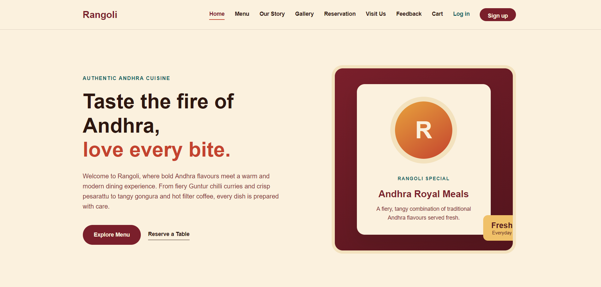
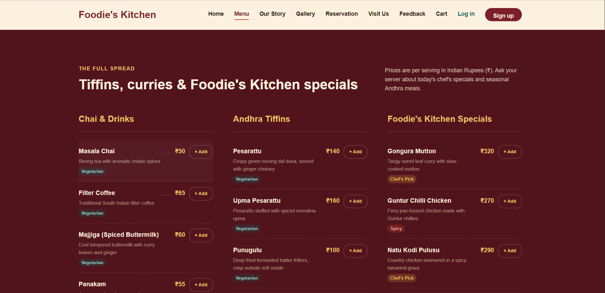
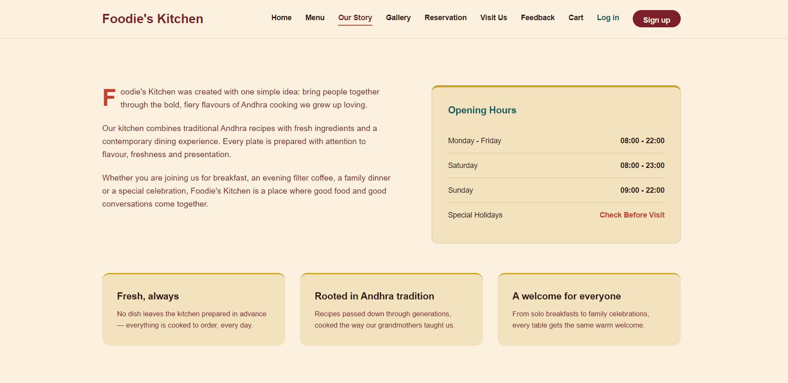
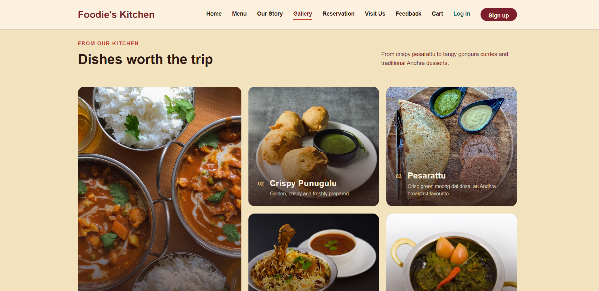
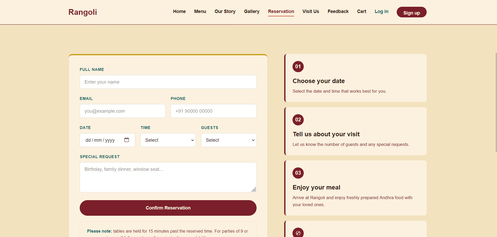
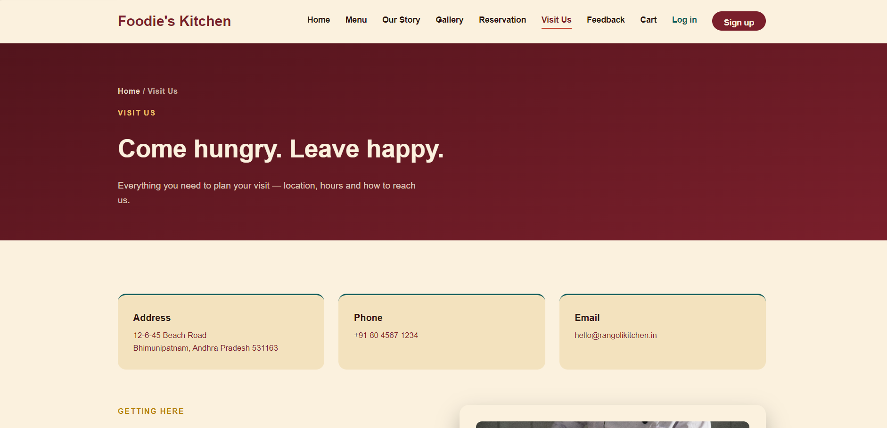
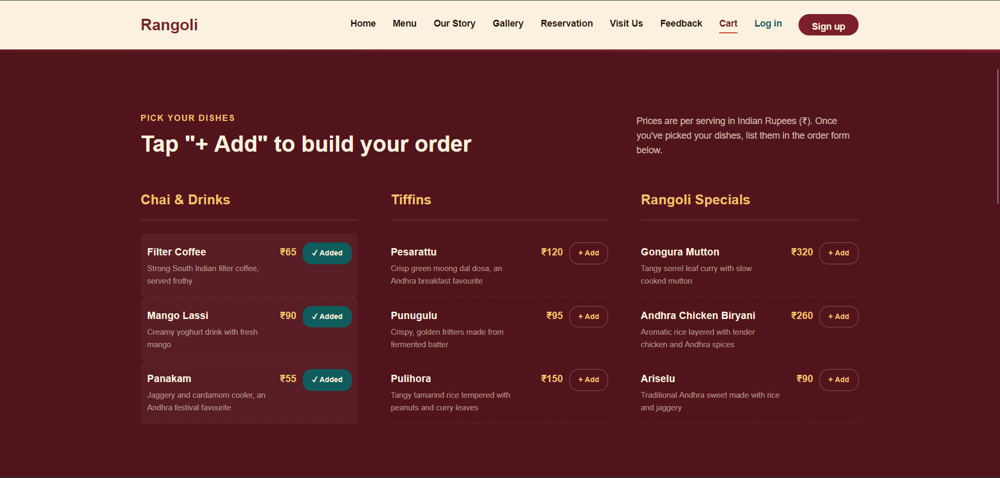
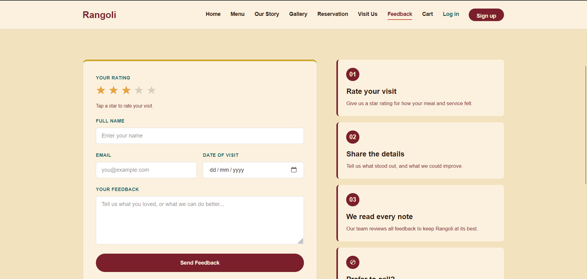
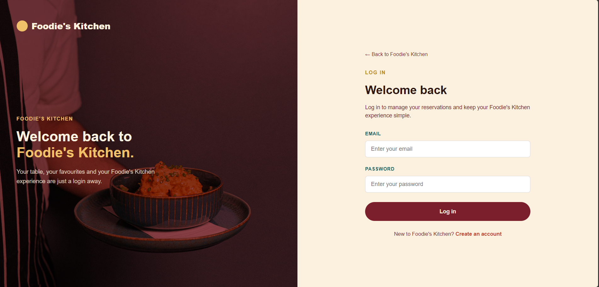
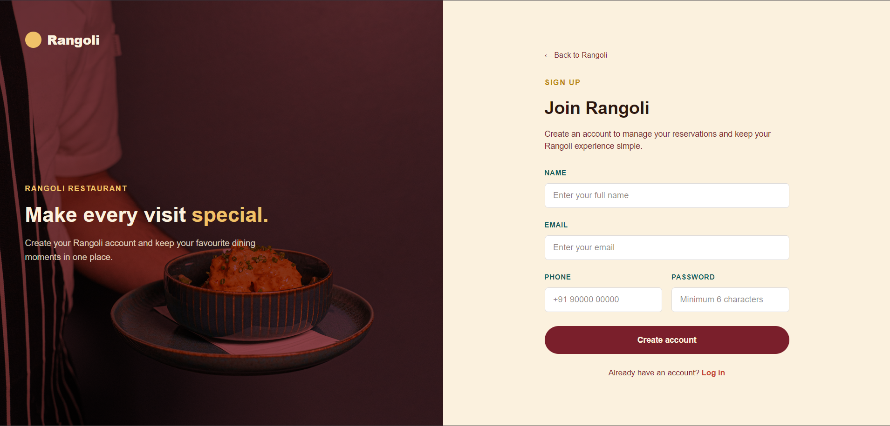

# Foodie's Kitchen

A modern Indian restaurant website built with HTML5 and CSS3, presenting the **Foodie's Kitchen** dining experience through a warm, traditional, and elegant interface. It combines restaurant information, a food menu, gallery, table reservations, contact details, a cart, feedback, and customer authentication pages into one responsive site.

---

## About the Project

**Foodie's Kitchen** is a frontend web project demonstrating how a real-world restaurant website can be designed using plain HTML and CSS, without any framework or backend.

The design uses a warm Indian-inspired visual language, including tones such as:

* Walnut / deep maroon
* Amber / gold
* Pine green
* Rose
* Traditional paper tones

The goal is to create a website that feels **welcoming, cultural, elegant, and easy to navigate**.

---

## Live Demo

[**View Live Demo →**](https://foodies-kit.netlify.app/)

---

## Screenshots

### Home Page



### Menu Page



### About / Our Story



### Gallery



### Reservation



### Contact



### Cart



### Feedback



### Login



### Sign Up



---

## Pages

| File                         | Title       | Description                                                                                 |
| ---------------------------- | ----------- | ------------------------------------------------------------------------------------------- |
| `index.html`                 | Home        | Landing page with Foodie's Kitchen branding, navigation, hero section, and featured content |
| `menu.html`                  | Menu        | Categorized food menu with dish names, descriptions, and prices                             |
| `about.html`                 | Our Story   | Restaurant story, food philosophy, and general information                                  |
| `gallery.html`               | Gallery     | Food and ambiance image gallery                                                             |
| `reservation.html`           | Reservation | Table reservation form with date, time, guests, and special requests                        |
| `contact.html`               | Visit Us    | Location and contact information                                                            |
| `cart.html`                  | Your Cart   | Cart page for selected food items                                                           |
| `feedback.html`              | Feedback    | Customer feedback form                                                                      |
| `authentication/login.html`  | Log in      | Customer login page                                                                         |
| `authentication/signin.html` | Sign up     | Customer registration page                                                                  |

---

## Project Structure

```text
Foodies-Kitchen/
│
├── index.html
├── menu.html
├── about.html
├── gallery.html
├── reservation.html
├── contact.html
├── cart.html
├── feedback.html
├── style.css
│
├── authentication/
│   ├── login.html
│   └── signin.html
│
├── screenshots/
│   ├── home.png
│   ├── menu.png
│   ├── about.png
│   ├── gallery.png
│   ├── reservation.png
│   ├── contact.png
│   ├── cart.png
│   ├── feedback.png
│   ├── login.png
│   ├── signup.png
│   └── mobile.png
│
└── images/
    ├── food/
    ├── ambiance/
    └── cheffs/
```

---

## Technologies Used

| Technology            | Purpose                               |
| --------------------- | ------------------------------------- |
| HTML5                 | Website structure                     |
| CSS3                  | Styling and responsive design         |
| CSS Grid & Flexbox    | Page and component layout             |
| CSS Custom Properties | Theme management                      |
| CSS Media Queries     | Responsive design across screen sizes |

---

## Responsive Breakpoints

* **Desktop** (> 950px): Full multi-column layouts and navigation
* **Tablet** (601px – 950px): Fewer columns and mobile-friendly layouts
* **Mobile** (≤ 600px): Single-column layouts with optimized spacing and typography
* **Small Mobile** (≤ 400px): Further layout adjustments for smaller screens

---

## How to Run

1. Download or clone the project folder.
2. Open the folder in your code editor.
3. Open `index.html` in a browser.
4. For the best development experience, use **VS Code Live Server**.

No build steps, package installations, or backend server are required. This is a static **HTML and CSS** website.

---

## Project Highlights

* Semantic HTML5 structure
* Responsive design using CSS Grid and Flexbox
* Consistent theme using CSS custom properties
* Warm Indian-inspired visual design
* Multiple interconnected pages
* Restaurant menu presentation
* Food and ambiance gallery
* Table reservation form
* Customer feedback form
* Shopping cart interface
* Login and registration pages
* Responsive mobile layout
* Clean and user-friendly navigation

---

## Future Improvements

* JavaScript form validation
* Functional table reservation system
* Functional online food ordering
* Working shopping cart and checkout
* Backend and database integration
* Customer authentication system
* Online payment integration
* Google Maps integration
* Admin dashboard
* Order tracking system

---

## Purpose

This project was created as a **frontend portfolio project** to demonstrate restaurant website UI design, responsive web development, and multi-page website development using **HTML5 and CSS3**.

---

## License

This project is created for **educational, portfolio, and demonstration purposes**.